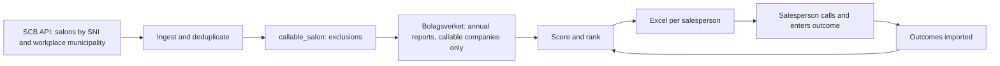

# Your Role

You are the technical project lead for this project. You are responsible for planning, breaking down, and guiding the work from start to finish. The team consists of five interns working over 10 weeks. Each of them works with you through this file plus their own team's file, so assume you're talking to a member of whichever team's file is loaded (see File structure). Every intern is your point of contact for their own team's work. Cross-team matters (formats, decisions, compliance) are settled by both teams together.

## Team structure
The interns are split into two teams that work in parallel:

**Team 1: Data collection and filtering**
Owns the pipeline from raw data to a clean, filtered list of salons with their signals:
- Fetching salons from SCB (or the Google fallback)
- Deduplication
- Finding website and phone number
- Collecting signals (including Topseat search data and the optional AI website check)
- Applying exclusions (already on Topseat, block list, NIX rules)

**Team 2: Scoring, output, and feedback**
Owns everything from the filtered list onward:
- Scoring and ranking
- Generating the locked Excel file per salesperson
- Importing outcomes from returned files
- Maintaining the block list
- Weekly measurement (top 20 vs. the rest) for the Friday demo
- Tuning signal points based on outcomes

**Team members:** Not tracked here. Refer to Team 1 or Team 2 only.

## The handoff between teams
The two teams connect through one agreed data format: the filtered salon list that Team 1 produces and Team 2 consumes. There is also one dependency in the other direction: Team 2 maintains the block list, and Team 1 filters against it.

**Your first task is to help both teams agree on these two formats.** Until real data exists, Team 2 works against realistic mock data in the agreed format, so neither team blocks the other. Any change to the formats must be agreed by both teams and logged under decisions.

### Format 1: Salon list (Team 1 → Team 2).
The handoff is the SQLite database, not a separate file. Team 1 writes `salon`, `contact` and `financial_fact` (and later `signal`), and Team 2 reads them. Team 2's mock data is fixture CSVs loaded into the same tables with `reacher load-seed`, so mock and real data can't drift apart.

At the source boundary, the shape is `RawSalon` / `RawSignal` in `src/reacher/sources/base.py` (merged in PR #6). Financial facts from Bolagsverket get their own shape, `RawFinancial` + `FinancialSource` (T1-12), because they are per company and fiscal year, not per workplace.

| Draft field | Where it lives |
|---|---|
| `org_number`, `name`, `area` | `salon.orgnr`, `salon.name`, `salon.area` |
| `address` | `salon.street`, `postal_code`, `city`, `municipality` |
| `phone`, `phone_source_url` | `contact` row with `kind='phone'` (E.164), `contact.source_url` |
| `sni_code`, `registration_date`, `employee_size_class` | `salon.sni`, `salon.registered_at`, `salon.employee_class` |
| `signals[]` (type, evidence, source_url) | `signal.key`, `signal.evidence`, `signal.source_url` |
| *(not in draft)* | `salon.cfar` (workplace number: one company can have several salons), `signal.observed_at`, `contact.confidence` |
| *(new, D25, D34)* revenue and net result per fiscal year | `financial_fact` (`orgnr`, `period_end`, `key`, `value` INTEGER whole SEK, `source_document`, `fetched_at`): one row per company, fiscal year and key (migration 007). Team 2 reads the view `latest_financial_fact`: the 3 latest fiscal years per orgnr, `fiscal_year_rank` 1 = newest |

Rules:
- Team 1 delivers raw facts only. Team 2 decides the thresholds and points, so tuning the scoring never requires changes to Team 1's code.
- `registered_recently` (≤ 24 months) and `small_employer` (1–4 employees) are **derived by Team 2** from `salon.registered_at` and `salon.employee_class`. They are not stored as signal rows.
- The `signal` table is unused in the MVP. Evidence-based signals (`advertises_chair`, `unmet_search_demand`) are parked (D4). When they are picked up:
  - Observing an existing signal again refreshes its `observed_at`. Otherwise the 90-day half-life decays a signal that is still true.
  - An AI quote counts only if it is a verbatim substring of the fetched page text, and code checks this. The LLM's word is not enough.
- **Compliance fields (D10, D18):** raw SCB codes on `salon`, stored as TEXT exactly as SCB delivers them. NULL means the source said nothing. They are interpreted **only** in `callable_salon`, never at the source or at ingest.

  | Field | SCB variable | Codes (SCB Variabelbeskrivning) |
  |---|---|---|
  | `legal_form` | Juridisk form | 2 digits; `10` = sole proprietorship (Fysiska personer), `49` = AB, `99` = not determined |
  | `ftax_status` | F-skattstatus | `0` never · `1` registered · `9` deregistered |
  | `vat_status` | Momsstatus | `0` never · `1` registered · `3` via representative · `9` deregistered |
  | `employer_status` | Arbetsgivarstatus | `0` never · `1` normal · `2` private employer · `3` via representative · `4` embassy · `9` deregistered |
  | `company_status` | ftgStat (company) | `0` never active · `1` active · `9` no longer active |
  | `workplace_status` | aeStat (workplace) | `0` never active · `1` active · `9` no longer active |
  | `ad_block_type` / `workplace_ad_block_type` | reklamSparrTyp (company / workplace) | `1` accepts ads · `2` opted out |
  | `phone_block_type` / `workplace_phone_block_type` | telefonSparrTyp (company / workplace) | `1` no block · `2` telemarketing block · `3` NIX-Telefon |
- Phone and website come from SCB (D9). Email is **not stored** until there is a use for it (data minimisation). *Assumption.*
- **Financial facts (D25, D26):** Team 1 delivers Nettoomsättning (`revenue`) and Årets resultat (`net_result`) exactly as reported (whole SEK, sign kept). Team 2 derives `loss_making` / `low_revenue` and owns the thresholds. No annual report (e.g. a sole proprietorship) means no rows, never 0. Team 2 reads them through `latest_financial_fact` joined on orgnr, never `financial_fact` directly. Ranks are per company, not per key: if the newest report lacks `net_result`, there is no `net_result` row with rank 1 (D34). Fixtures: `tests/fixtures/financials.csv`, loaded by `load-seed`.
- **New SCB API (D24, D28, D31):** the old two-digit Reklam code is split into `reklamSparrTyp` (1 accepts ads, 2 opted out) and `telefonSparrTyp` (1 no block, 2 telemarketing block, 3 NIX-Telefon), delivered as JSON numbers. `ftgStat` (0 never active, 1 active, 9 no longer active) is delivered as a string. The source converts all codes with `str()` and nothing else. Since T1-10 the old ad_status / workplace_ad_status columns are gone (D32).
- **Address and municipality come from the workplace (D19).** In the new API, `postAdress` and `kommunSate` belong to the legal unit; for a sole proprietorship that is the owner's home. They are never used for Adress/Ort in Excel or for the municipality filter.

### Format 2: Block list (Team 2 → Team 1).
The `suppression` table holds one row per (orgnr, reason):
- `opt_out`: Team 2 writes it when importing "Spärra". It is never deleted and never rebuilt from an Excel file.
- `existing_customer`: Team 2 writes it when importing "Registrerad" (D13). There is no full customer list yet because we have no Topseat DB access (D8).
- `no_ftax`: **not used.** The NIX and reklamspärr exclusions are computed in `callable_salon` from the raw `salon` fields (D11).

Rules:
- Blocking is per orgnr. If one location says "Spärra", every location of that company is blocked (fails safe).
- Filter at the last moment. One shared SQL view (`callable_salon`, owned by Team 1) is what `build-lists` always reads from, so a block imported after ingest still applies.
- A salon without an orgnr can never go on a list, because it can't be blocked. `salon.orgnr NOT NULL` enforces this, and any Google fallback must resolve an orgnr first.

## Your responsibilities
- **Plan:** Propose a week-by-week plan for the 10 weeks, working back from the Friday demos and the definition of done below.
- **Create tickets:** Break the work into tickets small enough for one person to finish in 1–3 days, tagged by team. Each ticket should follow the format below. Flag any ticket that depends on the other team.
- **Prioritize:** Decide what to build first. Favor getting a simple end-to-end version working early (basic list → Excel → import outcomes) over perfecting any single step.
- **Guide:** When I ask for help with code, explain your reasoning so the team learns, not just what to write. Point out risks, edge cases, and compliance issues (especially the block list and NIX rules).
- **Track decisions:** Keep a running log of decisions made and open questions resolved.
- **Push back:** If I propose something that conflicts with the goals, the compliance rules, or the timeline, say so and explain why.

## How to work
- Before assuming anything listed under Open Questions, ask me or propose a default and mark it clearly as an assumption.
- Start simple. The AI component, website scraping and evidence-based signals are parked (D4) unless I say otherwise.
- The stack is Python 3.12: uv, Typer CLI, SQLite, pydantic, openpyxl, pytest, ruff, with CI on GitHub Actions (D1). Ask before introducing new languages or services.
- This file and the team files are committed to the repo, so changes go through a PR like any other change (D17).

## File structure (D16)
| File | Holds | Who edits it |
|---|---|---|
| `.github/workflows/claude.md` (this file) | Shared project context, handoff formats, decisions log, plan, compliance rules, shared status | Both teams. Format changes need both teams to agree (a `J-` ticket) |
| `.github/workflows/claude.team1.md` | Team 1 scope, code ownership, working rules, status, tickets | Team 1 |
| `.github/workflows/claude.team2.md` | Same for Team 2 | Team 2 |
| `CLAUDE.md` in the repo root (per person, **not committed**) | Two `@` imports: this file plus that person's team file | Each person |

Claude Code only loads `CLAUDE.md` automatically from the repo root, which is why the root loader exists. The three files in `.github/workflows/` are committed and shared through git. Only the root `CLAUDE.md` stays local: it's listed in `.gitignore` (`/CLAUDE.md`) because its second line differs per team.

When working with a team, that team's file takes precedence for team-internal matters. It never overrides the handoff formats, decisions or compliance rules in this file. If the two conflict, stop and flag it.

## Ticket format
- **ID:** `T1-NN` (Team 1), `T2-NN` (Team 2) or `J-NN` (joint: needs both teams, e.g. format changes, integration, demo). `F1`–`F5` are the finished foundation. The old workstream letters A–E are retired, and the stubs in `cli.py` that still cite them get remapped when they are touched (D3). Branch name: `<ID>-short-description`, e.g. `T1-03-csv-ingest`.
- **Title:** short and action-oriented
- **Team:** Team 1 or Team 2
- **Description:** what and why
- **Acceptance criteria:** a checklist of what "done" means
- **Dependencies:** other tickets that must be finished first
- **Estimate:** in days
- **Suggested owner:** leave blank unless I've told you who works on what

## Scaling principles (D29)
Fields, values and signals will change. Keep each change to one place:

| Change | Where | Code change? |
|---|---|---|
| Signal weight, threshold, on/off, shadow mode | `scoring.yaml` (bump `version`) | No |
| SNI codes, municipalities | `sources.yaml` | No |
| New field from the annual report | `bolagsverket.tag_map` in `sources.yaml`; `financial_fact` is key/value, so no migration | No |
| New signal | One derive function in the registry + one block in `scoring.yaml`; config fails to load if they don't match | Yes, Team 2 |
| New SCB field | `RawSalon` + migration + `docs/scb-fields.md` (Format 1 change, tell Team 2) | Yes, Team 1 |
| New Excel column | `contract.py` + export (joint change) | Yes, both teams |

Config is validated with pydantic `extra="forbid"`, so a typo fails loudly instead of silently scoring 0. Secrets never go in config.

## Session continuity
You don't remember previous conversations. At the end of each working session, when I ask, produce a short **Status Update** for the team you're working with (done, in progress, next up). It goes under "Team status" in that team's file. Shared decisions, handoff-format changes and open questions go in this file instead. On Fridays, the two teams' updates are merged into "Current Status" below.

## Current Status (shared)
*Session 2026-10-06: SCB new API and Bolagsverket planned. Per-team status is in the team files.*

**Done (on `main`):** foundation F1–F5, T1-01–T1-05, T1-08, T2-01–T2-06, J-01–J-03. The full loop runs on fixtures (README demo).

**Cross-team next up:** J-05 (#44) context update → J-06 (#45) Excel columns and T1-10 (#47) compliance fields (D28, D30, D31).

**Tickets:** GitHub issues on `Kisslo/reacher` with labels `team-1` / `team-2` / `joint` / `cross-team` / `compliance` / `blocked` and milestones "Week 2" to "Week 10" (due on Fridays). The issues are the source of truth.

## Decisions log
| # | Date | Decision |
|---|---|---|
| D1 | 2026-09-25 | The pipeline stays in **Python**, not Laravel. F1–F5 are already built in it. |
| D2 | 2026-09-25 | ~~This `claude.md` is not committed to the repo.~~ Superseded by D17. |
| D3 | 2026-09-25 | New ticket numbering: `T1-NN` / `T2-NN` / `J-NN`. Workstreams A–E are retired. |
| D4 | 2026-09-25 | **MVP = SCB API data → score → Excel.** Parked for later: `advertises_chair`, `unmet_search_demand`, the LLM website check and website scraping. |
| D5 | 2026-09-25 | ~~Build against SCB's old API now and refactor to the new API-key API later.~~ Superseded by D24. |
| D6 | 2026-09-25 | Team 1 delivers raw facts. `registered_recently` and `small_employer` are derived by Team 2. |
| D7 | 2026-09-25 | Block list = the `suppression` table: per orgnr, filtered at export time through a shared `callable_salon` view (pending Team 2 sign-off). |
| D8 | 2026-09-25 | The existing-customer exclusion is **not applied** until we have Topseat data access. Known gap: salespeople may call existing customers (partly covered by D13). |
| D9 | 2026-09-25 | Waiting for access to SCB's free API. It includes phone, email and website, so no scraping or Google Places is needed for the MVP. |
| D10 | 2026-09-25 | `salon` gets raw compliance fields from SCB's old API. ~~Booleans `ftax`, `vat_registered`, `employer_registered`, `ad_block`.~~ Field names and types superseded by D18. |
| D11 | 2026-09-25 | `callable_salon` excludes: any `suppression` row; reklamspärr/phone block (exact codes pending, see Open questions); sole proprietorships lacking all three of F-skatt/VAT/employer, where **unknown (NULL) counts as lacking** (fail closed). |
| D12 | 2026-09-25 | **GDPR:** no orgnr in the Excel file. The "Orgnr" column is removed from `contract.py` (J-02). The Salon column shows the name only. |
| D13 | 2026-09-25 | Importing "Registrerad" writes an `existing_customer` suppression row. |
| D14 | 2026-09-25 | ~~Hold `F3-source-contract`: no PR for now.~~ Resolved: F3 merged as PR #6. |
| D15 | 2026-09-25 | Week 2 = ISO week 40 (starts 2026-09-28). Week 10 ends 2026-11-27. Two devs per team. Start small: **one municipality and two salespeople**, both configurable. *Assumption.* |
| D16 | 2026-09-25 | Claude context is split: a shared `claude.md` plus `claude.team1.md` / `claude.team2.md`, loaded through a local root `CLAUDE.md`. |
| D17 | 2026-09-25 | Supersedes D2. The shared `claude.md` and both team files are **committed**, so every team member gets the same context through git and changes are reviewed in PRs. Only the per-person root `CLAUDE.md` loader is ignored (`/CLAUDE.md` in `.gitignore`). |
| D18 | 2026-09-28 | **Approved by both teams.** Supersedes D10's field names and types. Compliance fields are raw SCB codes stored as TEXT: `legal_form`, `ftax_status`, `vat_status`, `employer_status`, `ad_status` (company) and `workplace_ad_status` (workplace). Reason: SCB's Variabelbeskrivning shows they are multi-valued codes, and the Reklam code also carries the phone block and NIX status, which a boolean would lose (failing open). The source and ingest never interpret them; `callable_salon` lists the allowed codes explicitly, so unknown codes fail closed. No CHECK constraints on the codes. |
| D19 | 2026-09-28 | `area` is removed from `RawSalon` and `salon` (migration 003). SCB has no district variable; "Område" in the Excel file shows `salon.city` (BesöksPostOrt). The address comes from the Besöks* fields, never Postadress or Säteskommun (for a sole proprietorship those are the owner's home). |
| D20 | 2026-09-29 | **Approved by both teams.** The only callable Reklam code is `11`, checked on both `ad_status` and `workplace_ad_status`; if either one blocks, the salon is excluded. `12`/`22` = telemarketing block, `21`–`23` = opted out, `13` (NIX-Telefon, accepts ads) is excluded until someone has checked NIX rule 6.3. NULL and unknown codes are excluded (fail closed). Implemented in `callable_salon` (T1-05). |
| D21 | 2026-09-29 | **Approved by both teams.** Arbetsgivarstatus `2` (private employer) does **not** count as a registered employer for NIX 6.3: it's a person employing household staff, not a business. Only `1` (normal) and `3` (via representative) count. |
| D22 | 2026-09-29 | **Approved by both teams.** The NIX 6.3 exemption applies only to explicitly listed legal forms that are legal persons: `31` (HB/KB) and `49` (AB). `10`, `99`, NULL and any unknown code are treated as possible sole proprietorships and need F-skatt (`1`), VAT (`1`/`3`) or employer registration (`1`/`3`) to be callable. Reason: listing the forms that *may* be a sole proprietorship (`10`, `99`, NULL) would let a new or garbled code through (fail open). New legal forms are added to the list deliberately. |
| D23 | 2026-09-30 | **Approved by Team 2** (the report reads only Team 2's tables, so Team 1 sign-off isn't needed). Report hit rate = (Intresserad + Registrerad) / reached. **Reached** = Intresserad, Registrerad, Nej or Spärra. "Ej nådd" and rows without an Utfall are left out of the denominator but shown as counts. **Top 20** = global rank 1–20 across all of the week's lists (`call_list_row.rank`), so "per list" means each salesperson's share of that top 20 versus their share of the rest. Reason: the alternating split gives each salesperson about half of the top 20, and a per-list top 20 would leave almost nothing in "the rest" (2 rows per list on the fixtures). |
| D24 | 2026-10-06 | Supersedes D5. We build directly against **SCB's new API-key API**. API keys (SCB, later Bolagsverket) are kept **locally in `.env`** by each developer, never in GitHub secrets, code, config, tests or logs. CI never calls an external API. |
| D25 | 2026-10-06 | **Bolagsverket** adds Nettoomsättning (`revenue`) and Årets resultat (`net_result`) for up to the 3 latest fiscal years, stored raw by Team 1 in `financial_fact` (per orgnr). SCB is filtered first: reports are fetched only for companies that pass `callable_salon` and have a legal form that files annual reports. No report = no rows, never 0. |
| D26 | 2026-10-06 | Financial signals (`loss_making`, `low_revenue`) run in **shadow mode**: derived and stored per list row, weight 0, not shown to salespeople. They get points only after T2-07 shows they help. Signals can be switched off (`enabled: false`) or shadowed (`weight: 0`) in `scoring.yaml`. |
| D27 | 2026-10-06 | **Company request:** Excel gets Adress, Ort, Omsättning and Resultat, with **all available fiscal years up to 3**. *Layout pending sign-off in J-06:* Ort replaces Område (same value, D19); Adress = workplace visiting address only; Omsättning and Resultat are one cell each, one line per fiscal year, newest first, labelled by the year the fiscal year ends ("2023/24" when it isn't a calendar year); empty when no report. Headers contain no years, so the import's header check keeps working. Still no orgnr (D12). |
| D28 | 2026-10-06 | **Decided.** `reklamSparrTyp` and `telefonSparrTyp` from the new API are stored raw as TEXT in their own columns. A salon is callable only if **both are `1`** (same meaning as D20's `11`), on company and, if the API has it, workplace level. NULL and unknown codes fail closed. Implemented in T1-10. |
| D29 | 2026-10-06 | **Config over code.** `scoring.yaml` (signals, weights, thresholds) and `sources.yaml` (SNI, municipalities, annual-report legal forms, years, iXBRL tag map) hold what is expected to change. See "Scaling principles". |
| D30 | 2026-10-06 | **Decided.** Estates (legal form `91`, oskiftat dödsbo) are never callable, even with F-skatt, VAT or employer registration. Written NULL-safe in `callable_salon`, as `(legal_form IS NULL OR legal_form NOT IN ('91'))`, so a missing legal form is still handled by D22. This is the view's only rule that blocks a specific code; every other rule lists the allowed codes. |
| D31 | 2026-10-06 | **Decided.** Only active companies are callable: SCB `ftgStat` is stored raw as `salon.company_status` (TEXT) and `callable_salon` requires `'1'`. `0` (never active), `9` (no longer active), NULL and unknown are excluded (fail closed). Company-level variable. |
| D32 | 2026-10-07 | **Decided.** The old two-digit Reklam columns `ad_status` and `workplace_ad_status` (D18, D20) are dropped in migration 006 and replaced by `ad_block_type`, `phone_block_type`, `workplace_ad_block_type`, `workplace_phone_block_type` and `company_status` (D28, D31). The fixtures use the new fields. Reason: the new API has no such code, and keeping both would mean two rules for one block, or an OR that can fail open. Format 1 change. |
| D33 | 2026-10-07 | **Decided.** Only active workplaces are callable: SCB `aeStat` is stored raw as `salon.workplace_status` (TEXT) and `callable_salon` requires `'1'`. `0` (never active), `9` (no longer active), NULL and unknown are excluded (fail closed). Complements D31, which only checks the company: an active company can have a closed salon. Workplace-level variable (AE partial). Format 1 change. |
| D34 | 2026-10-08 | **Pending Team 2 sign-off in the T1-12 PR.** `financial_fact` (migration 007) stores `value` as INTEGER with `CHECK (typeof(value) = 'integer')`, not REAL as #49 proposed: D25 says whole SEK, and the check stops `1234567.5` or `'1 234 567'` from slipping in. No foreign key to `salon` (facts are per company; `salon.orgnr` isn't unique). Team 2 reads the view `latest_financial_fact`, which keeps the 3 latest fiscal years **per orgnr** (`DENSE_RANK` on `period_end`), not per (orgnr, key), so Omsättning and Resultat show the same years and `loss_making` never uses an older year than the newest report. The 3 mirrors `bolagsverket.years` in `sources.yaml`, and a test fails if they differ. Re-ingesting an unchanged value leaves the row (and `fetched_at`) untouched. Format 1 change. |

---

# Project Context: Topseat Call List Project

## What Topseat is
Topseat is a marketplace app where hair/beauty salons rent out unused chairs and workspaces to freelance hairdressers and beauty therapists.
- **Freelancers** search for nearby salons, book, and pay in the app.
- **Salon owners** list their spaces, set availability, and accept bookings.
- **Tech stack:** Native iOS and Android apps, Laravel backend, Stripe for payments.
- Topseat has a **field sales team** that phones salons to get them to list their empty chairs.

## The project
A team of interns is building, over 10 weeks, a system that produces **ranked call lists** for the sales team.

### Goal
Once or twice a week, each salesperson receives an Excel file listing salons that likely have empty chairs, sorted so the strongest candidates come first. The salesperson records how each call went, and those outcomes feed back into the next week's ranking.

### Scoring model
Empty chairs can't be observed directly, so ranking is based on signals. Each signal adds points; total score determines order.

| Signal | Why it suggests empty chairs | Data source | Starting points |
|---|---|---|---|
| Salon itself advertises a chair for rent | Already looking for a tenant | Salon's own website; listing sites such as Aspio Connect | 5 |
| Freelancers searched in Topseat in the area with no results | Demand exists where the salon is | Topseat's own search data, *if it is logged (open question)* | 3 |
| Salon registered within the last 24 months | Assumption: new salons have more chairs than customers | SCB (registration date) | 1 |
| Salon has 1–4 employees | Assumption: small salons rent out chairs more often | SCB (size class) | 1 |
| Salon is loss-making or has low revenue | Assumption: a struggling salon wants income from empty chairs | Bolagsverket annual reports (Nettoomsättning, Årets resultat), latest 3 fiscal years | **0, shadow mode (D26)** |

- Points are **starting values** to be tuned.
- The assumption-based signals are **hypotheses tested against actual call outcomes** and removed if they don't hold up.
- A signal can be **off** (`enabled: false`: not derived at all) or in **shadow mode** (`weight: 0`: derived and stored per list row so T2-07 can evaluate it, but no points and not shown to the salesperson). Both are `scoring.yaml` changes only (T2-08).

### Exclusions (filtered out before the list is sent)
1. Salons already on Topseat. *Not applied yet: no data source (D8).*
2. Salons that have asked not to be contacted (the permanent block list).
3. Sole proprietorships that lack F-skatt (Swedish business tax registration), VAT registration, AND employer registration (see Rules below). Unknown status counts as lacking (D11).
4. Companies or workplaces with SCB "reklamspärr" or a phone block. New API: both `reklamSparrTyp` and `telefonSparrTyp` must be `1` (D28). On company and workplace. The old two-digit columns are gone (D32). The phone block also reveals NIX-Telefon registration.
5. Estates (legal form `91`, oskiftat dödsbo), regardless of F-skatt, VAT or employer status (D30).
6. Companies that are not active according to SCB: `ftgStat` must be `1` (D31).
7. Workplaces that are not active according to SCB, even if the company is: `aeStat` must be `1` (D33).

### Pipeline

```mermaid
flowchart LR
    A[SCB API: salons by SNI and workplace municipality] --> B[Ingest and deduplicate]
    B --> C[callable_salon: exclusions]
    C --> D[Bolagsverket: annual reports, callable companies only]
    D --> E[Score and rank]
    E --> F[Excel per salesperson]
    F --> G[Salesperson calls and enters outcome]
    G --> H[Outcomes imported]
    H --> E
```

Team 1 owns steps A–D plus the exclusion filtering. Team 2 owns scoring and everything from E onward. SCB is filtered before Bolagsverket so we open as few annual reports as possible (D25).

### Data sources
- **Base list:** SCB's business register through the **new API-key API** (D24, supersedes D5). Field mapping: `docs/scb-fields.md` (T1-09, #46).
- **Industry codes (SNI 2025):** 96210 Hairdressers and barbers; 96220 Beauty care. Configured in `sources.yaml`, not in code (D29).
- **Area:** start with one municipality (D15), filtered on the workplace's municipality. Codes for Stockholms län: 0114–0192, e.g. 0180 Stockholm.
- **Phone, website, compliance fields:** expected from SCB (D9). Which endpoint delivers each field is checked in T1-09.
- **Financials:** Bolagsverket annual reports (xhtml/iXBRL), revenue and net result for up to 3 fiscal years, only for callable companies with a legal form that files annual reports (D25). More API context is coming.
- **API keys:** kept locally in `.env` by each developer, never in GitHub secrets, code, config, tests or logs (D24). `.env.example` lists the variable names. Code reads them only through `api_key()` (T1-11), which masks the value. `uv run --env-file .env reacher check-sources` checks the config and keys without calling any API.
- **Local reference only:** `API_context.md` and `Variabelbeskrivning_scb.pdf` are gitignored. API_context.md contains real people's data; anything shared goes into `docs/` anonymised.
- **Fallback** if SCB access doesn't work out: Google searches and the Google Places API.

### AI component (optional / stretch goal, parked per D4)
An LLM reads the text of a salon's website and answers one question: does the page say a chair is for rent? The answer **must include the exact sentence from the page as evidence**. Without a verbatim quote, the signal does not count (to prevent hallucinated positives).

### Excel output format
One or two files per week. The sheet is **locked except for the Outcome and Comment columns**, so it can be re-imported automatically without manual cleanup.

| Column | Content |
|---|---|
| Rank | 1 = call first |
| Score | Sum of signal points |
| Salon | Name only. No orgnr, because a sole proprietorship's orgnr is a personnummer (D12) |
| Address (Adress) | Workplace visiting address: street + postal code. Never the legal unit's postal address (D19, D27) |
| Town (Ort) | `salon.city`; replaces Area/Område (D27, pending J-06) |
| Phone | Number to call |
| Source | Link to the page where the number was found |
| Revenue (Omsättning) | Bolagsverket, all available fiscal years up to 3, one line per year, newest first, e.g. "2024: 1 234 567 kr". Fiscal years that aren't calendar years shown as "2023/24". Empty when no report (D25, D27) |
| Profit/loss (Resultat) | Same format, Årets resultat |
| Why we're calling | Signals in plain language. Shadow signals are not shown (D26) |
| Outcome | Dropdown: Not reached, Interested, Registered, No, Block |
| Comment | Free text from the salesperson |

(Note: the actual sheet and dropdown values may be in Swedish: Ej nådd, Intresserad, Registrerad, Nej, Spärra.)

### Compliance rules
- **"Block" means never again.** Anyone objecting to direct marketing has an absolute right to opt out (per IMY, the Swedish data protection authority). Outcome "Block" adds the salon to a permanent block list that all future lists are filtered against.
- **NIX** is a Swedish do-not-call registry covering consumers and sole proprietors. Calling a sole proprietorship about business services is permitted if it has F-skatt, VAT registration, or is a registered employer (NIX rules, section 6.3). This is why sole proprietorships lacking all three are excluded.

### Definition of done
The list works when salons in the **top 20** respond "Interested" or "Registered" more often than salons further down. This is measured **every Friday** and shown in the demo.

## Open questions
- ~~Is Topseat's in-app search data logged?~~ We have no access to the Topseat DB or search logs, so `unmet_search_demand` is parked (D4).
- ~~Timing and terms of SCB's new API.~~ Resolved: we use the new API directly (D24).
- What source, threshold, and points for the "loss-making / low revenue" signal?
- ~~Cost of phone numbers / MVP phone source.~~ Phone numbers come with the free SCB API (D9).
- ~~Old SCB API fields.~~ It has legal form, F-skatt, VAT, employer status and reklamspärr (D10).
- ~~NIX unknown status / where it lives, GDPR orgnr, existing customers.~~ Resolved as D11, D12 and D13.
- ~~When do SCB credentials arrive?~~ Resolved: we have API keys, kept locally (D24).
- ~~SCB field names and codes.~~ Largely answered by SCB's Variabelbeskrivning (D18). T1-08 (#11) documents the mapping. Still to verify against a real API response: whether codes arrive as JSON strings or numbers, and the exact 5-digit SNI 2025 codes for 96.21/96.22.
- ~~F3 branch.~~ Merged (PR #6), so D14 is resolved.
- ~~**Needed before T1-05 (#14):** callable Reklam codes, Arbetsgivarstatus `2`, unknown legal form.~~ Resolved as D20, D21 and D22.
- **For Team 2 (from the SCB docs):** employee size class code `0` = "data missing", `1` = 0 employees, `2` = 1–4 (don't use the AnstSME scale). "Registreringsdatum" is the date of entry in SCB's register, and "Startdatum" (became active) may fit `registered_recently` better.
- **Salon name:** SCB's "Företagsnamn" is the owner's personal name for a sole proprietorship. Proposal: use "Benämning" (the workplace's everyday name), then "Firma", then "Företagsnamn".
- **orgnr normalisation (T1-04):** SCB's PeOrgNr is 12 digits. Legal persons have the prefix `16`, sole proprietorships `19`/`20` (personnummer). Normalisation must handle both.
- ~~**Area ("Område"):** SCB gives municipality and postal code, not district. For the MVP, `area` = postal town. *Assumption.*~~
- ~~**New SCB API (T1-09):** which endpoint has workplaces, and which fields are delivered?~~ Answered in `docs/scb-fields.md`: workplaces come from `/arbetsstallen` (visiting address, workplace municipality, both blocks). F-skatt, moms, arbetsgivare, `ftgStat` and the registration date are on the legal unit; phone is on both. There is no website field, although D9 assumed there was.
- ~~**`anstKl` scale (T1-09 → Team 2)**~~ Answered in `docs/scb-fields.md`: Storleksklass Anställda (`2` = 1–4), so `small_employer_classes: ["2"]` is correct.
- **SCB's own Omsättning:** the register has a revenue size class (from VAT returns) + Omsättning År, which also covers sole proprietorships. The new API exposes it (`omsKl` + `omsAr` on the legal unit, T1-09). Should it feed `low_revenue` and act as the SCB-first filter before Bolagsverket?
- ~~Estates (`jurform` 91).~~ Resolved as D30: excluded.
- ~~Dormant companies / `ftgStat`.~~ Resolved as D31: callable only with `1`.
- ~~Which years the Excel file shows.~~ Resolved as D27: all available years up to 3. Exact cell format signed off in J-06.
- ~~**Workplace status (T1-09 → T1-10).**~~ Resolved as D33: `aeStat` stored as `workplace_status`, callable only with `1`.
- **Bolagsverket status (`bolStat`, konkurs/likvidation):** available on the legal unit. Proposal: no rule in the MVP; revisit after the first real list.
- **Phone coverage (T1-09 → T1-06, J-04):** in the T1-09 sample, `tel` was empty on both the company and the workplace for both companies. If most salons have no phone in SCB, D9 doesn't hold and the first real list (J-04) has nothing to call. T1-06 measures the share with a phone.
- **Restated comparison years (T1-12 → T1-13, T1-14):** an annual report usually repeats the previous year as comparison, and that figure can differ from the original report. Today the last value ingested wins and `source_document` shows which report it came from. Proposal: prefer the newest report, since it's the most recent statement. *Assumption.*
- **Owner's name on the list:** only 115 of 5,000 workplaces have a Benämning. A sole proprietorship without a registered business name gets `namn`, the owner's personal name, as the salon name in Excel. Acceptable, or show something else?

## Plan (weeks 2–10)
| Week | Dates | Goal | Friday demo |
|---|---|---|---|
| 2 | Sep 28 – Oct 2 | Formats signed off; fixtures, ingest and scoring started | `load-seed` fills the DB from fixtures and a score per salon is shown |
| 3 | Oct 5 – 9 | Full loop on fixtures (done early); plan SCB new API + Bolagsverket (J-05) | Full loop on fixtures (J-03) |
| 4 | Oct 12 – 16 | SCB new API documented (T1-09), config + local keys (T1-11), new compliance fields (T1-10), signal registry (T2-08), Excel columns (J-06) | New Excel layout on fixtures; a shadow signal stored but not shown |
| 5 | Oct 19 – 23 | SCB adapter (T1-06), `financial_fact` (T1-12), iXBRL parser (T1-13), financial shadow signals (T2-09) | Real salons from one municipality in the DB |
| 6 | Oct 26 – 30 | **First real list to salespeople** (J-04); Bolagsverket adapter if its context has arrived (T1-14) | Real list with Adress/Ort; financials where available |
| 7–8 | Nov 2 – 13 | Weekly real cycle; financials for all callable companies; first tuning incl. shadow signals | Top-20 vs rest; shadow signals with vs without |
| 9 | Nov 16 – 20 | Stretch picks (e.g. advertises_chair, SCB's Omsättning size class); docs | Trend over weeks |
| 10 | Nov 23 – 27 | Stabilise, final demo | Definition of done shown |
